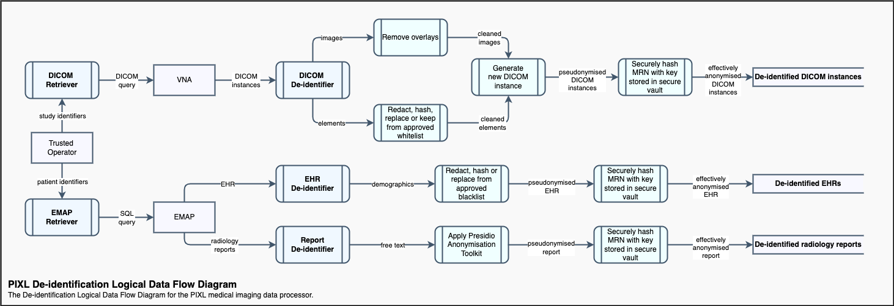

# De-identification

The technical elements of the de-identification process are purposefully limited for the [MVP](MVP.md).
The strategy is to initially lean on the other 4 Safes rather than attempt to immediately produce a gold-plated automated anonymisation process for both pixel data or every possible private DICOM element. This approach allows standing up of the infrastructure scaffolding around which more complex de-identification strategies will be constructed for subsequent versions.

## Hashing
As is standard practice, a hashing function will be used to de-identify any personal identifiers which need to retain their uniqueness in relation to the rest of the data.  
The [BLAKE2](https://en.wikipedia.org/wiki/BLAKE_(hash_function)#BLAKE2) hashing function will be used. It is an efficient cryptographic hashing function and the original algorithm was a SHA-3 finalist. BLAKE2 is used in the Linux kernel RNG and is the hashing function for the WireGuard VPN.   
To mitigate the risk of a brute force attack in the rare event of an identifier leak, the hashing function will be used as part of a Hash-based Message Authentication Code primitive, or in so-called "keyed hashing mode". This usage pattern involves the addition of a secret key as part of the digest generation process. The secret key will be stored in Azure Key Vault. We will refer to this process as _secure hashing_ to distinguish it from simply applying a hashing function.

## Primary Identifiers
After filtering on opt-out status, the primary patient identifier will be securely hashed and stored alongside the original in an on-prem PostgreSQL database.
This lookup database will be for tracing and debugging purposes and will not be made available to researchers.

## DICOM Instances
The [MVP](MVP.md) will be limited to the de-identification of DICOM elements and disclosure risk from pixel data will be managed via [policies](./Referenced_notes/disclosure-incidents.md) for the FlowEHR platform.  
Extensive DICOM metadata is not required for the NGT-CXR project so a whitelisting strategy will be pursued for including elements.  

A configuration file will be created to specify the list of DICOM elements to include in the output and the transformations to apply to each.  
The following operations will be available for processing DICOM elements:  

**Operation** | **Effect**
---|---
keep | Retain as is
fixed | Replace with a constant
change | Replace with a new GUID
date-floor | Truncate a date or date time to the start of the day
date-shift | Shift a date or date time by the specified number of days (applied at study scope)
num-range | Floor & ceiling limits for a numerical value 
hash | BLAKE2 hashing with 48-byte digest (base64 encoded)
secure-hash | BLAKE2 keyed hashing with 48-byte digest and 64-byte key from Azure Key Vault (base64 encoded)

The list of elements and corresponding transformations within scope of the MVP can be found [here](DICOM_tags). Instances will be stripped from all other elements not included in the whitelist.  

Overlays will be removed from DICOM instances but no "pixel scrubbing" will be performed for the MVP. More advanced techniques for removing text which has been embedded in images will be developed in a subsequent version.

## Radiology Reports
Developing custom NLP de-identification techniques lies outside the focus of the PIXL project.  
The NGT-CXR team have obtained ethics approval to use the [Microsoft Presidio](https://github.com/microsoft/presidio/) OSS data anonymisation tool for de-identification of free text data. It is however important to note that no such tool can guarantee the ability to remove all sensitive information and remaining disclosure risk will need to be managed by policies & procedures. 

## Electronic Health Record
No data points which would present a risk of _direct_ identification will be retrieved from the EHR.