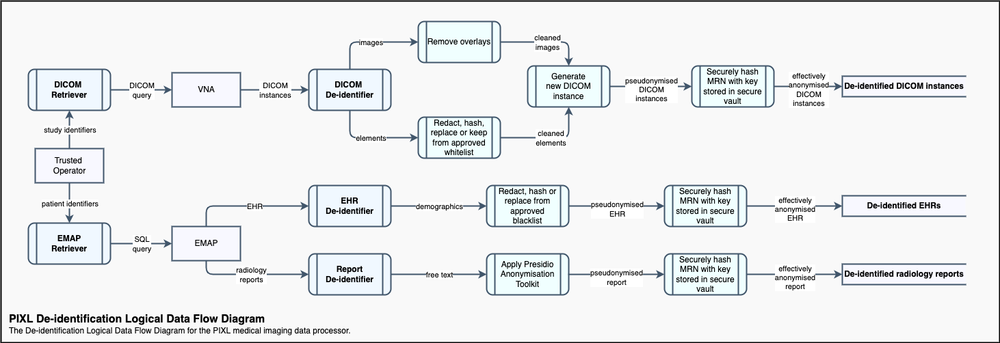

# Summary Overview
UCLH intends to develop the capability to enable safe medical imaging research at scale by utilising cloud infrastructure.  
  The collaboration agreement between UCLH and Microsoft Research presents an opportunity to drive this capability building through the NGT-CXR "Radiology Co-pilot" project. See the [Research Programme Plan](./Referenced_notes/UCLH_MSR_Research_Programme_Plan_COPY_12_09_2022.docx) for further details about this project.

# Objective
The primary objective is to deliver a technical system and associated governance policies and procedures, driven by the [Five Safes framework](https://ukdataservice.ac.uk/help/secure-lab/what-is-the-five-safes-framework/), which provides safe researcher access to _effectively anonymised_ UCLH medical imaging data.  
This will be achieved through
- Suitable de-identification of configurable batches of DICOM images, radiology reports, demographics & selected observations (`Safe Data`) without adverse impact on operational imaging & data systems;
- Storing de-identified data on a DICOM node and EHR data & reports in a Data Lake, both running in Azure and governed by Role-Based Access Control (`Safe Setting`);
- Instantiating a Trusted Research Environment workspace specific to the approved NGT-CXR project and providing a clear disclosure risk incident reporting procedure (`Safe Project`);
- Managing access from the TRE workspace to the DICOM node and Data Lake with Azure Active Directory users & group membership for a trained research team with UCLH honorary contracts (`Safe People`); 
- Requiring broad stakeholder consensus for any egress from the TRE workspace, including data and model artifacts (`Safe Outputs`).

# Scope
Scope will be limited to batch processing of specific but configurable cohorts and a limited set of associated EHR data points. 
The system will comply with the [NHS National Data Opt-out](https://digital.nhs.uk/services/national-data-opt-out/compliance-with-the-national-data-opt-out/check-for-national-data-opt-outs-service).   
The purpose is to serve approved & trained researchers with UCLH honorary contracts (Safe People), in an environment under strict access control (Safe Setting) with restriction on extraction of any artifacts from the environment (Safe Outputs).
Consequently the system will not guarantee perfect anonymisation to a level where data can be made available for public release.  
As per ICO guidelines, pseudonymised data will be considered _effectively anonymised_ within the TRE workspace as researchers will not have access to any link tables or cryptographic keys. See chapters 1-3 of the latest ICO [guidance on anonymisation, pseudonymisation & privacy enhancing technologies](https://ico.org.uk/about-the-ico/ico-and-stakeholder-consultations/ico-call-for-views-anonymisation-pseudonymisation-and-privacy-enhancing-technologies-guidance/).   
Furthermore, the reality is that de-identification of DICOM data is inherently imperfect due to a possibility of Personally Identifiable Information leaking via private DICOM elements or burnt into images. Hence the system must include policies & procedures in addition to technical controls in order to provide a robust solution.  
The automated de-identification process will initially be limited to DICOM elements, radiology reports and PII in the EHR. It will be assumed that images are free from burn-in. Disclosure risk from burn-in will be addressed via procedures while subsequent versions will address pixel de-identification via an automated technical solution.  

# Technical Requirements
- Compute & storage resources on a GAE for processing small batches of DICOM data in serial
- Access & permission to query the PACS & VNA from an Application Entity running on a GAE 
- Access & permission to query the EMAP UDS & IDS
- HTTPS access from the local PIXL application to Azure
- An Azure-hosted DICOM node backed by Azure Blob storage
- An Azure-hosted instance of Delta Lake
- An Azure TRE with VNet access to the DICOM node

# Technical Risks
The primary technical risk is overburdening the PACS & VNA and causing an adverse impact on the operational performance of these systems.  
To mitigate this risk, queries will be managed with a task queue. The system will enforce rate limiting of any commands sent to the PACS & VNA with an adapted [token bucket](https://en.wikipedia.org/wiki/Token_bucket) algorithm which can be adjusted at runtime in response to system load. A [circuit breaker](https://en.wikipedia.org/wiki/Circuit_breaker_design_pattern) will wrap the retrieval processes and act as fail-safe. Individual request retries will be subject to an [exponential backoff](https://en.wikipedia.org/wiki/Exponential_backoff) strategy.

# De-identification

The technical elements of the de-identification process are purposefully limited for the alpha version.
The strategy is to initially lean on the other 4 Safes rather than attempt to immediately produce a gold-plated automated anonymisation process for both pixel data or every possible private DICOM element. This approach allows standing up of the infrastructure scaffolding around which more complex de-identification strategies will be constructed for subsequent versions.

## Hashing
As is standard practice, a hashing function will be used to de-identify any personal identifiers which need to retain their uniqueness in relation to the rest of the data.  
The [BLAKE2](https://en.wikipedia.org/wiki/BLAKE_(hash_function)#BLAKE2) hashing function will be used. It is an efficient cryptographic hashing function and the original algorithm was a SHA-3 finalist. BLAKE2 is used in the Linux kernel RNG and is the hashing function for the WireGuard VPN.   
To mitigate the risk of a brute force attack in the rare event of an identifier leak, the hashing function will be used as part of a Hash-based Message Authentication Code primitive, or in so-called "keyed hashing mode". This usage pattern involves the addition of a secret key as part of the digest generation process. The secret key will be stored in Azure Key Vault. We will refer to this process as _secure hashing_ to distinguish it from simply applying a hashing function.

## Primary Identifiers
After filtering on opt-out status, the primary patient identifier will be securely hashed and stored alongside the original in an on-prem PostgreSQL database.
This lookup database will be for tracing and debugging purposes and will not be made available to researchers.

***!!Questions***   
- Do we need to hash the Study & Series IDs too?
  Do these include hospital or other identifying attributes?
  Can this wait until beta?

## DICOM Instances
As defined in _Scope_, the initial version will be limited to the de-identification of DICOM elements and disclosure risk from pixel data will be managed via policies & procedures.  
Extensive DICOM metadata is not required for the NGT-CXR project so a whitelisting strategy will be pursued for including elements.  
A configuration file will be created to specify the list of DICOM elements to include in the output and the transformations to apply to each.  
Instances will be stripped from all other elements not included in the whitelist.  
The following operations will be available for processing DICOM elements:
**Operation** | **Effect**
---|---
keep | Retain as is
fixed | Replace with a constant
date-floor | Truncate a date or date time to the start of the year
date-shift | Shift a date or date time by the specified number of days (applied at study scope)
num-range | Floor & ceiling limits for a numerical value 
hash | BLAKE2 hashing with 48-byte digest (base64 encoded)
secure-hash | BLAKE2 keyed hashing with 48-byte digest and 64-byte key from Azure Key Vault (base64 encoded)

***!!Questions***   
- What other VR types & operations need to be supported?

## Radiology Reports
Developing custom NLP de-identification techniques lies outside the focus of the PIXL project.  
The NGT-CXR team have obtained ethics approval to use the [Microsoft Presidio](https://github.com/microsoft/presidio/) OSS data anonymisation tool for de-identification of free text data. It is however important to note that no such tool can guarantee the ability to remove all sensitive information and remaining disclosure risk will need to be managed by policies & procedures. 

## Electronic Health Record
No data points which would present a risk of direct identification will be retrieved from the EHR.

# Policies & Procedures
## Policies
- System & Usage Scope  
  Guidelines to define the boundaries of the system and its objectives.
- User & Project Requirements  
  Technical, governance and financial obligations required of projects and users.

## Procedures
- User & Project On-boarding  
  To execute at the start of a project or user participation journey.
- User & Project Off-boarding  
  To execute at the end of a project or user participation journey.
- Data Egress Management   
  To perform when analysis results or other data are to be removed from the environment. 
- Disclosure Incident Reporting  
  To be followed by researchers when encountering PII.
- Disclosure Incident Management  
  Tasks and responsibilities when responding to an incident of PII disclosure.
- Operational Systems Impact Management  
  Instructions for monitoring and management as to ensure minimal impact on operational systems.

# Key Technologies
- [Docker Compose](https://docs.docker.com/compose/)
- [Python](https://www.python.org)
  - [pydicom](https://github.com/pydicom/pydicom)
  - [pynetdicom](https://github.com/pydicom/pynetdicom3)
  - [deid](https://pydicom.github.io/deid/)
  - [Azure SDK for Python](https://docs.microsoft.com/en-us/azure/developer/python/sdk/azure-sdk-overview)
- [Celery](https://docs.celeryq.dev/en/stable/)
- [Redis](https://redis.io)
- [Orthanc](https://www.orthanc-server.com/static.php?page=documentation)
- [DICOM DIMSE](https://www.dicomstandard.org/current)
- [DICOMweb](https://www.dicomstandard.org/using/dicomweb)
- [SQL Server](https://www.microsoft.com/sql-server)
- [PostgreSQL](https://www.postgresql.org)
- [Delta Lake](https://delta.io)
- [Feathr](https://linkedin.github.io/feathr/)
- [Terraform](https://www.terraform.io)
- [Azure Blob storage](https://docs.microsoft.com/en-us/azure/storage/blobs/)
- [Azure DICOM Service](https://docs.microsoft.com/en-us/azure/healthcare-apis/dicom/dicom-services-overview) based on the [Microsoft OSS DICOM Server](https://github.com/microsoft/dicom-server)
- [Apache Spark](https://spark.apache.org) in [Azure Synapse](https://docs.microsoft.com/en-us/azure/synapse-analytics/spark/apache-spark-overview)
- [Microsoft Purview](https://docs.microsoft.com/en-gb/azure/purview/)
- [Azure TRE](https://github.com/microsoft/AzureTRE)
- [OpenTelemetry](https://opentelemetry.io)
- [Azure Monitor](https://docs.microsoft.com/en-us/azure/azure-monitor/overview)
- [Presidio](https://microsoft.github.io/presidio/) 
- [Azure Key Vault](https://docs.microsoft.com/en-us/azure/key-vault/general/)
- [Azure Active Directory](https://docs.microsoft.com/en-us/azure/active-directory/)
- [Azure Policy](https://docs.microsoft.com/en-us/azure/governance/policy/overview)
- [Azure RBAC](https://docs.microsoft.com/en-us/azure/role-based-access-control/)
- [Azure Functions](https://docs.microsoft.com/en-us/azure/azure-functions/functions-overview)
- [Azure Machine Learning](https://docs.microsoft.com/en-us/azure/machine-learning/)

# Security Considerations
## Inbound access to the Cloud Environment in Azure  
It is expected that a VPN connection (or ExpressRoute connection) between the on-prem UCLH estate and Azure will not initially be available.  
Point-to-point firewall restrictions and Azure access tokens will manage secure access to the DICOM service.
## Researcher access to the Research Workspace  
The Research Workspace will not be accessible from the public internet.
Access will only be available from Trust devices, either physical or via a Citrix session.
## Outbound access from the on-prem PIXL process
All outbound connections will be over HTTPS.
The existing proxy service will be relied upon to manage outbound access from the GAE.

# Diagrams

## System Context

## Deployment Units

## Components
### PIXL

### FlowEHR

Security Considerations
Inbound access to the Cloud Environment in Azure
It is expected that a VPN connection (or ExpressRoute connection) between the on-prem UCLH estate and Azure will not initially be available.
Point-to-point firewall restrictions and Azure access tokens will manage secure access to the DICOM service.

Researcher access to the Research Workspace
The Research Workspace will not be accessible from the public internet. Access will only be available from Trust devices, either physical or via a Citrix session.

Outbound access from the on-prem PIXL process
All outbound connections will be over HTTPS. The existing proxy service will be relied upon to manage outbound access from the GAE.

Requires that

### PIXL
_On-prem_ 

0. We **intelligently query the PACS/VNA** for ~300k chest X-rays without causing it to fall over
1. We **de-identify DICOM elements** with a simple whitelisting approach and **remove PII overlays** 
1. We **de-identify free-text radiology reports** with Presidio 
1. We **de-identify PII EHR** attributes 
1. We **link** de-identified data securely 
1. We **push DICOM instances** to Azure 
1. We **push radiology reports & EHR data** into Delta Lake on Azure   

(see [PIXL]((https://github.com/UCLH-DIF/PIXL)) for more details)  

### FlowEHR
_Azure_ 