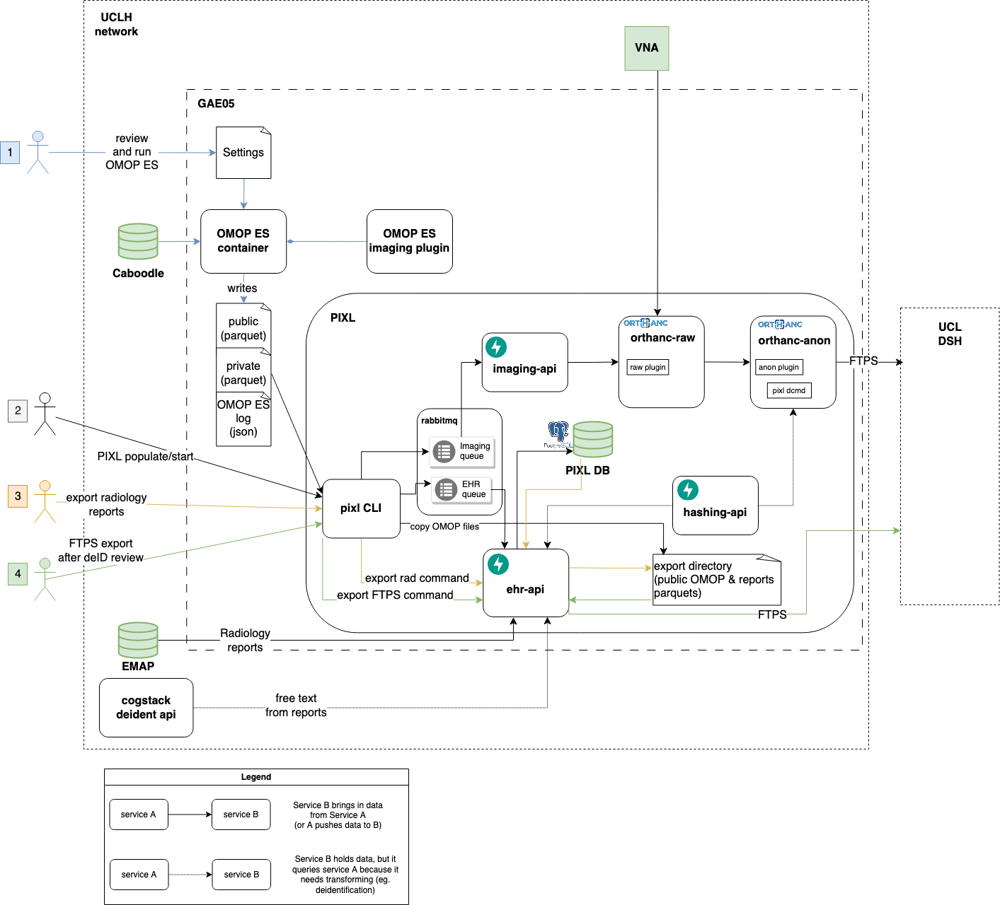

# 100 day plan data export

## Background

The data export part of the 100 day plan aims to export chest X-rays to the UCL Data Safe Haven (DSH) for MSc student projects.

This will use existing UCLH services:

- OMOP ES for cohort definition and structured patient data extraction
- Cogstack free text de-identification api to anonymise radiology reports
- PIXL to export and de-identify chest X-ray DICOM data and radiology reports

## Constraints

- PIXL is an open source project and the Clarity and Caboodle databases are EPIC intellectual property, so queries using these databases can't exist
  in the PIXL repository.
- Aiming for reasonable but not perfect solutions given the time for the project
- DSH allows data ingress using FTPS only currently
- VNA should only be requested to move images once per project, to reduce load
- De-identification of radiology reports should be checked before export? 
- De-identification and linking of data should all happen within the UCLH network

## Not in scope

- System-wide automated tests
- CI/CD based processing and transfer automation tool
- Separate project-based identifier hashing component

## Data flow through components

There will be 3 stages for exporting data to the DSH:

1. The configuration of an OMOP ES extract will be reviewed in GitHub and added to version control.
   The `OMOP ES` container will be run based on this using `Caboodle` as a data source, using the OMOP ES imaging plugin to extract
   imaging study data: accession number and study datetime.
   `OMOP ES` will write files into 2 groups (plus a log file) as an input to PIXL:
    - Public parquet files that have had identifiers removed and replaced with a sequential ID for the export
    - Private link files (parquet) that map sequential identifiers to patient identifiers (e.g. MRNs, Accession numbers, NHS numbers)
    - log file (json) which contains the extract datetime, project name and a hash of the OMOP ES repository for the extract
2. The `PIXL` pipeline will be run, using the OMOP output files as an input, with the `PIXL CLI` populating the imaging and EHR queues by reading the public and
   private
   parquet files to generate messages that contain the MRN, accession number, study datetime, project name and OMOP ES extract datetime.
   The `PIXL CLI` also copies the public parquet files that are accessible to the `ehr-api` for later export
    - The `imaging-api` queries the VNA for the study and if it exists, the DICOM data is sent to `orthanc-raw`
        - `orthanc-raw` acts as a cache for identifiable images by storing as much DICOM data as possible, and sending the DICOM data to
          the `orthanc-anon` service, along with the project name.
        - `orthanc-anon` uses an allow-list approach with DICOM tags, each of these having a defined action which allows for de-identification. The
          accession number will be hashed by the `hashing-api` for linking to the EHR data.
          This will also reject any images which are not of the expected modality. After the image has been de-identified, the DICOM data will be sent
          to the DSH using FTPS
    - The `ehr-api` will access `EMAP` for imaging reports and de-identify them using the `cogstack deidentification api`
        - The de-identification will be checked with another method to have a rough metric of certainty in the ongoing de-identification in case of
          data drift. This will be persisted to the postgres database along with any of the reports which are flagged as containing identifiable data.
        - The accession number will be hashed using the `hashing-api`
        - The de-identified radiology reports will be saved to a parquet file, which acts as a link between the OMOP ES sequential study identifier
          and the hashed accession number
3. The de-identification will be reviewed and then the `PIXL CLI` will be used to send a REST request to the `ehr-api` to export the public and report
   parquet files to the DSH using FTPS.

