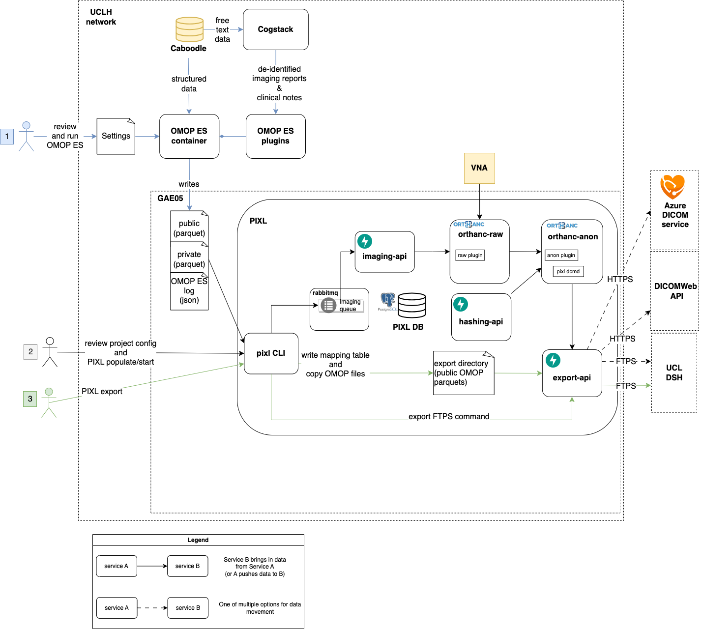

# System design for linkage and export of imaging and EHR data

## Background

Continuation of work in [100 day plan](../archive/100-day-design.md). 
This iteration will aim to bring in MRI and CT data, with a more coherent design using OMOP ES, Cogstack, an identifier hashing service and PIXL.

This will use existing UCLH services:

- OMOP ES for cohort definition and structured patient data extraction, with an escape hatch option of a flatfile input for pre-Epic imaging data
- Cogstack for free text data retrieval and de-identification
- PIXL to retrieve, de-identify, and export DICOM data. Also allow for export of electronic health record data (including radiology reports and clinical notes)

## Constraints

- PIXL is an open source project and the Clarity and Caboodle databases are EPIC intellectual property, so queries using these databases can't exist
  in the PIXL repository.
- Projects may store their DICOM data in the UCL Data Safe Haven (DSH), an Azure DICOM service or a NHS Digital approved (Data Security and Protection Toolkit) DICOMWeb-compliant server. 
- Imaging studies retrieved from the VNA should be cached and reused across runs within the PIXL infrastructure to the maximum extent possible (e.g. limited by GAE storage limits) to reduce unecessary query and retrieval from UCLH imaging systems.
- De-identification and linking of data should be managed within the UCLH network using a maintained suite of Standard Operating Procedures
- Each project should have its own salt used for hashing
- Need time to consider the ramifications of OMOP ES using constant pseudonyms for identifiers, 
  so PIXL will keep on using its own hashing service for linking images to OMOP data in a mapping parquet file.  
  This adds extra overhead on researchers with multiple extracts over time, but is a reasonable tradeoff.

## Not in scope

- System-wide automated tests
- CI/CD based processing and transfer automation tool

## Data flow through components

There will be 3 stages for exporting data from UCLH since Epic:

0. The de-identification of clinical notes and imaging reports will be trained and validated before any of the electronic health record data will
   be exported in Step 3.
1. `OMOP ES` will define the cohort and 
   - The configuration of an OMOP ES extract will be reviewed in GitHub and added to version control.
   - The `OMOP ES` container will be run based on this using `Caboodle` as a data source, using the OMOP ES plugins to bring in imaging information.
   - This will then request clinical notes and imaging reports from `Cogstack`, which will be de-identified before returning to `OMOP ES`.
   - In the case of emergency imaging (where the study UID will not match), the imaging accession number will also be exported.
   - `OMOP ES` will write files into 2 groups (plus a log file) as an input to PIXL:
      - Public parquet files that have had identifiers removed and replaced with a sequential ID for the export
      - Private link files (parquet) that map sequential identifiers to patient identifiers (e.g. MRNs, Accession numbers, NHS numbers)
      - log file (json) which contains the extract datetime, project name and a hash of the OMOP ES repository for the extract
2. The `PIXL` pipeline will be run, to process the imaging data
   - A project is registered to PIXL using a pull request of the project configuration, only projects in the source code can be processed.
   - Using the `OMOP ES` output files as an input, with the `PIXL CLI` populating the imaging and EHR queues by reading the public and private 
     parquet files to generate messages that contain the:
     - study UID
     - MRN
     - accession number
     - study datetime
     - project name
     - OMOP ES extract datetime
   - The CLI command `pixl populate` command persists the details of each message being sent for processing so that the progress can be tracked and 
     the pseudonymised data can be linked with a project for export later on.
   - The `imaging-api` requests that `orthanc-raw` queries the VNA for the study and if it exists, the DICOM data is sent to `orthanc-raw`
     - `orthanc-raw` acts as a cache for identifiable images by storing as much DICOM data as possible (with the max. storage size being configurable), and sending the DICOM data to
       the `orthanc-anon` service.
     - `orthanc-anon` uses an allow-list approach with DICOM tags, each of these having a defined action which allows for de-identification.
       This will also reject any images which are not of the expected modality.
       The imaging identifiers will be hashed by the `hashing-api` for linking to the EHR data.
       To enable a mapping table export in the next step, the hashed study UID will be saved to the PIXL database along with the input fields.
     - After the image has been de-identified, the DICOM data will be sent to three possible configurations from the `export-api`:
       - An Azure DICOM service, with the `export-api` sending a REST request to orthanc anon to send it onwards
       - A researcher-managed DICOMWeb compliant server, with the `export-api` sending a REST request to orthanc anon to send it onwards 
       - To the DSH directly via FTPS
3. The CLI command `pixl export` will export all electronic health record data.
   - The PIXL database will be queried for all images that have been exported from the project, 
     mapping their OMOP ES sequential IDs with the hashed identifiers used in the imaging export. 
   - This mapping table will be written into an export-specific directory accessible by the `export-api`
   - The command will copy over the public files from the `OMOP ES` extract, into the same export-specific directory.
   - All of these files are then exported via FTPS to the secure endpoint
