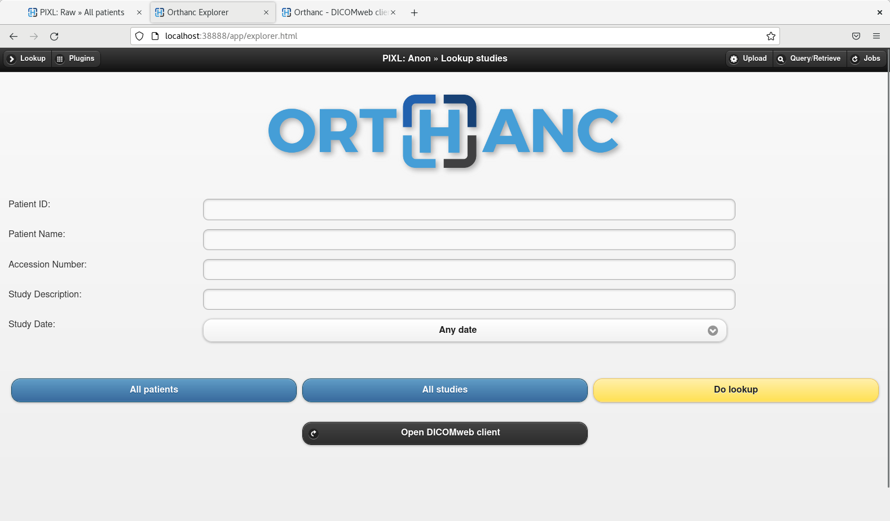
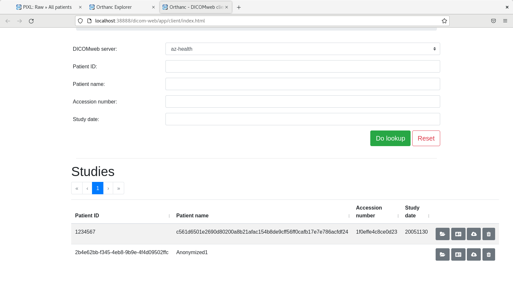

# Orthanc Anon

_The Orthanc instance responsible for anonymising DICOM data from PACS/VNA and forwarding to Azure DICOM service._

## Setup 

### Prerequisites

The following assumptions are made:
- `Orthanc Raw` is operational and auto-routing is configured to send data from `Raw` to `Anon`.
- `Hasher API` is available.
- The Azure AD`Tenant ID`, `App ID` and `Client Secret` have been configured.
- The Azure DICOM service endpoint is available and has been configured.
- Outbound HTTPS access to the Azure DICOM service is available.
- There is sufficient local storage for the `orthanc-anon-data` volume.

### Configuration

- The Docker image is based on `osimis/orthanc`. 
- Configuration is driven through customised JSON config. files stored in the [config](./config/) directory. 
- The files are populated with values from enviroment variables and injected into the container as secrets. Orthanc interprets all `.json` files in the `/run/secrets` mount as config. files.
- The instance configuration comprises three files:
  - `dicom.json` - Controls the AE Title for this instance, the details of the `Raw` instance and the config stub for DICOMWeb (to enable configuration of the Azure DICOM service at runtime).
  - `orthanc.json` - Controls the instance name, RBAC, storage and enabling plugins. (Plugins are required to enable the Python plugins)
- The anonymisation is carried out by an Orthanc Python plugin [anon.py](./plugin/anon.py). This plugin uses the [pixl_dcmd](../../pixl_dcmd/) package to apply the anonymisation scheme. `anon.py` is also responsible for the auto-routing of anonymised studies to the Azure DICOM service.

### Step 1
Save credentials `.env` for 'Orthanc anon' and the Azure DICOM Service.
```
# PIXL Orthanc anon instance
ORTHANC_ANON_USERNAME=
ORTHANC_ANON_PASSWORD=     
ORTHANC_ANON_AE_TITLE=
ORTHANC_ANON_HTTP_TIMEOUT=60
ENABLE_DICOM_WEB=true

# DICOMweb endpoint
AZ_DICOM_ENDPOINT_NAME=
# https://<workspace>-<dicomservicename>-node.dicom.azurehealthcareapis.com/v1/
AZ_DICOM_ENDPOINT_URL=
AZ_DICOM_ENDPOINT_CLIENT_ID=
AZ_DICOM_ENDPOINT_CLIENT_SECRET=
AZ_DICOM_ENDPOINT_TENANT_ID=

# Exposed ports for debugging / testing.
ORTHANC_ANON_DICOM_PORT=XXXX
ORTHANC_ANON_WEB_PORT=YYYY
```

### Step 2

Start the instance via Docker compose.

### Step 3

If you have chosen to expose the portas, you should now be able to navigate the web interface at `http://localhost:<YYYY>`, supply the chosen credentials and will be presented with the Orthanc web interface:


### Step 4
From the interface, you can view data stored on the instance or perform Query/Retrieves against the Azure DICOM service. Similarly you can target the instance over DIMSE on port `XXXX`, if exposed.

## Step 5
The advanced user interface can be found at `http://localhost:YYYY/ui/app/`. This can be used to check connectivity to the other modalities and the running configuration.

## Step 6
The Azure DICOM service can be accessed via the `DICOMWeb client`: 


## Local development
- It is assumed that you will be using docker compose, if not, then you need to mount the contents of the `config` directory onto `/run/secrets` within the cotainer.

## Troubleshooting

- If modifying any of the `.json` configuration files, any typo will cause the instance to fail to start.
- To use the REST interface, the web port must be exposed.
- To use DIMSE, the DICOM port must be exposed.
- DICOMWeb is enabled on this instance. _Any data pushed to this instance will be anonymised and forwarded via STOW to the configured Azure DICOM service target_.

## References
 - [Cheat sheet of the REST API](https://book.orthanc-server.com/users/rest-cheatsheet.html)

