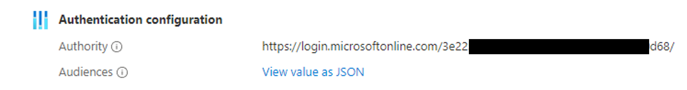

# Retrieving an access token for the DICOM service using and Azure AD application

To use the Azure Health Data Services DICOM service it is necessary to 
obtain an access token.

While it is possible to get this token interactively via the [Azure CLI](https://learn.microsoft.com/en-us/azure/healthcare-apis/dicom/dicom-get-access-token-azure-cli-old), the token can also be obtained through an Azure AD App. To implement the following, it is assumed that you have sufficient privileges in AAD to a) register an application b) grant `Dicom.ReadWrite` permissions over the Azure API of the DICOM Service.

## Steps

1. [Register the client application for the DICOM service in Azure Active Directory](https://learn.microsoft.com/en-us/azure/healthcare-apis/dicom/dicom-register-application)
2. In the Azure portal, navigate to **DICOM Service** > **`DICOM Node`** > **Properties**. The Authentication authority should now be: `https://login.microsoftonline.com/<TENANT_ID>`:

3. You need the following information:
  - `CLIENT_ID` of the AAD app.
  - `CLIENT_SECRET` created within the app.
  - `TENANT_ID`
4. To obtain the token, send a GET request to the Authentication Authority token endpoint wtih the following `form-data`:
```
client_id: ${CLIENT_ID}
grant_type: 'client_credentials'
client_secret: ${CLIENT_SECRET}
resource: 'https://dicom.healthcareapis.azure.com'
```
Example call:
```bash
curl https://login.microsoft.com/${TENANT_ID}/oauth2/token -d "client_id=${CLIENT_ID}&grant_type=client_credentials&client_secret=${CLIENT_SECRET}&resource=https://dicom.healthcareapis.azure.com"

# Response
{"token_type":"Bearer","expires_in":"3599","ext_expires_in":"3599","expires_on":"1668426620","not_before":"1668422720","resource":"https://dicom.healthcareapis.azure.com","access_token":"eyJ0eXA....<REDACTED>}
```