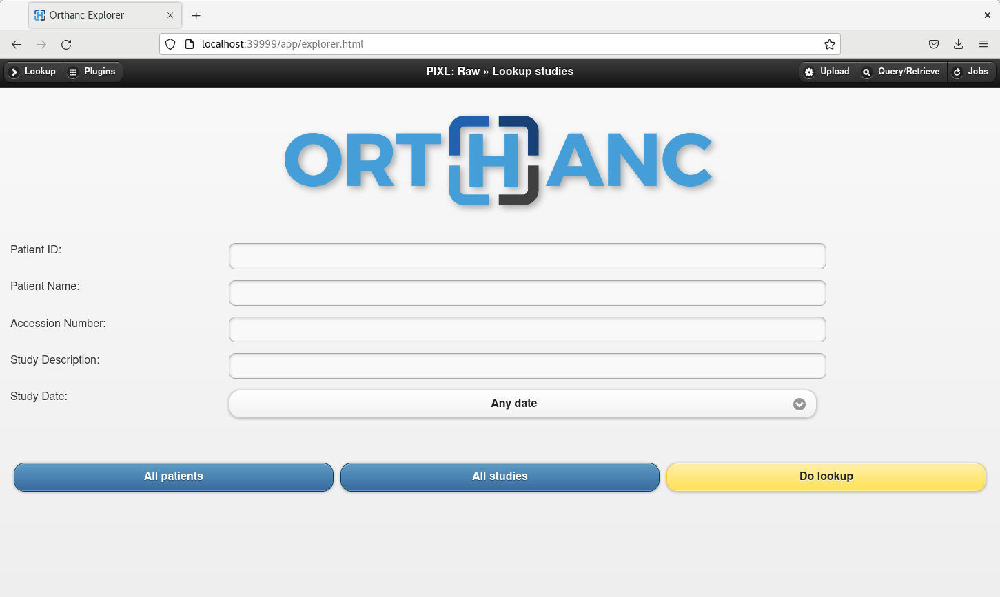

# Orthanc Raw

_The Orthanc instance storing raw DICOM data from PACS/VNA._
This instance mainly serves as a cache before de-identification in
[`orthanc-anon`](../orthanc-anon/README.md).

A custom [plugin](./plugin/pixl.py) is used to implement the auto-routing of studies from
`orthanc-raw` to `orthanc-anon`.

## Setup

### Prerequisites

The following assumptions are made:

- There is a PostgreSQL database available (currently [defined in
`pixl_core`](../../pixl_core/README.md)) to store the Index data within Orthanc (or it will become
available shortly when the service is started).
- The IPs, ports and AE Titles for the primary (VNA) and secondary (PACS) Q/R targets have been provided,
  and the reciprocal details for this instance have been shared with the PACS team.
- There is sufficient local storage for the `orthanc-raw-data` volume.

### Configuration

- The Docker image is a deployment of `orthancteam/orthanc` with some extra configuration
  - `ORTHANC_RAW_MAXIMUM_STORAGE_SIZE` to limit the storage size
  - `ORTHANC_RAW_JOB_HISTORY_SIZE` has been increased so that while there is concurrent processing,
    the job should always exist for being able to query its status
  - `ORTHANC_CONCURRENT_JOBS` has been increased to allow for more concurrent transfers from
    the VNA to orthanc raw.
  - `PIXL_DICOM_TRANSFER_TIMEOUT` is added to `ORTHANC_RAW_EXTRA_STABLE_SECONDS` to ensure that a
    study which hangs during processing isn't made stable until after the job would have timed out
- All configuration is driven through customised JSON config files stored in the [config](./config/)
directory.
- The files are populated with values from environment variables and injected into the container as
secrets. Orthanc interprets all `.json` files in the `/run/secrets` mount as config. files.
- The instance configuration comprises three files:
  - `dicom.json` - Controls the AE Title for this instance, the details of the PACS/VNA targets and
  the Orthanc instance responsible for anonymisation.
  - `orthanc.json` - Controls the instance name, RBAC, ensuring the storage is on disk, while the DB
  is held in PostgreSQL and enabling plugins. (Plugins are required to enable the PostgreSQL driver)
  - `postgres.json` - Configuration of the PostgreSQL DB.

### Step 1

Save credentials `.env` for the VNA (primary) and PACS (secondary) Q/R targets, postgreSQL and 'Orthanc anon'.
```
# PIXL PostgreSQL instance
PIXL_DB_HOST=
PIXL_DB_PORT=
PIXL_DB_NAME=
PIXL_DB_USER=
PIXL_DB_PASSWORD=

# Exposed ports
ORTHANC_RAW_DICOM_PORT=XXXX
ORTHANC_RAW_WEB_PORT=YYYY

# PIXL Orthanc raw instance
ORTHANC_RAW_USERNAME=
ORTHANC_RAW_PASSWORD=
ORTHANC_RAW_AE_TITLE=

# PIXL Orthanc anon instance
ORTHANC_ANON_AE_TITLE=

# UCPRIMARYQR DICOM node information
PRIMARY_DICOM_SOURCE_AE_TITLE=
PRIMARY_DICOM_SOURCE_PORT=
PRIMARY_DICOM_SOURCE_IP_ADDR=

# UCSECONDARYQR DICOM node information
SECONDARY_DICOM_SOURCE_AE_TITLE=
SECONDARY_DICOM_SOURCE_PORT=
SECONDARY_DICOM_SOURCE_IP_ADDR=
```

### Step 2

Start the instance via Docker compose.

### Step 3

You should now be able to navigate the web interface at `http://localhost:<YYYY>`, supply the chosen
credentials and will be presented with the Orthanc web interface:


### Step 4

From the interface, you can view data stored on the instance or perform Query/Retrieves against VNA for debugging purposes. Similarly you can target the instance over DIMSE on port `XXXX`.

### Step 5

The advanced user interface can be found at `http://localhost:YYYY/ui/app/`. This can be used to check connectivity to the other modalities and the running configuration.

## Local development

- It is assumed that you will be using docker compose, if not, then you need to mount the contents
of the `config` directory onto `/run/secrets` within the container.

## Troubleshooting

- If modifying any of the `.json` configuration files, any typo will cause the instance to fail to
start.
- If the postgreSQL DB is not available, the instance will fail to start.
- In production, the IPs, ports and AE Titles must match those given to / received from the PACS
team.
- To use the REST interface, the web port must be exposed.
- To use DIMSE, the DICOM port must be exposed.
- DICOMWeb is (deliberately) not enabled on this instance.

## References

 - [Cheat sheet of the REST API](https://book.orthanc-server.com/users/rest-cheatsheet.html)
